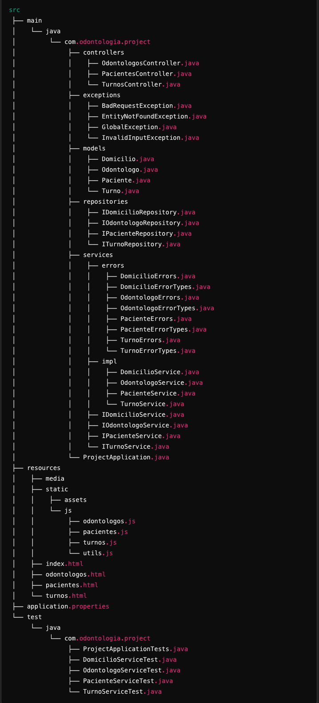
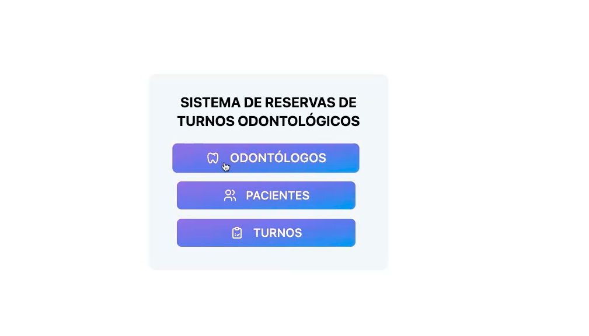
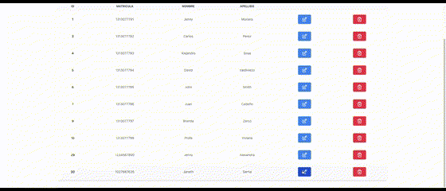
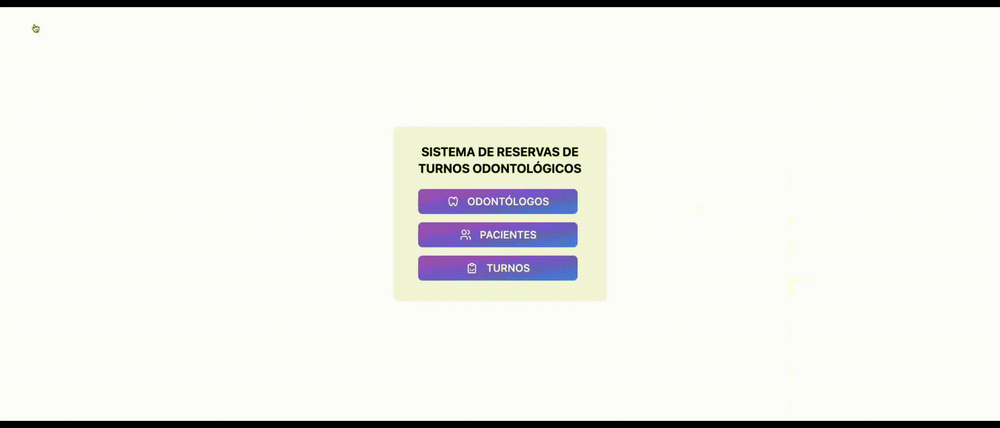
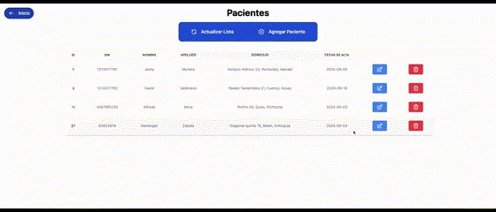

<h1 align="center">SISTEMA DE AGENDAMIENTO DE TURNOS ODONTOLÓGICOS</h1>

<h2 align="center">PROYECTO INTEGRADOR DE BACKEND I [DIGITAL HOUSE]</h2>

## 📋 **DESCRIPCIÓN:**

Este proyecto Java, desarrollado utilizando el framework Spring Boot,
tiene como objetivo crear un backend para un sistema de gestión de turnos en una clínica dental.
Permite programar citas, administrar pacientes y odontólogos.

## 👩‍💻👨🏻‍💻 **INTEGRANTES**

1. Jenny Alexandra Munera Serna.
2. Andrés David Intriago Valdiviezo.

## 🛠️ **Funcionalidades del Proyecto**

- `Funcionalidad 1`: **Sistema de reserva de turnos** Se desea implementar un sistema que permita administrar la reserva
  de turnos para una clínica odontológica. Este debe cumplir con los siguientes requerimientos:
- `Funcionalidad 2`: **_Administración de datos de odontólogos:_** listar, agregar, modificar y eliminar odontólogos.
  Registrar apellido, nombre y matrícula de los mismos.
- `Funcionalidad 3`:**_Administración de datos de los pacientes:_** listar, agregar, modificar y eliminar pacientes. De
  cada uno se almacenan: nombre, apellido, domicilio, DNI y fecha de alta.
- `Funcionalidad 4`: **_Registrar turno:_** se tiene que poder permitir asignar a un paciente un turno con un odontólogo
  a una determinada fecha y hora.
- `Funcionalidad 5`: **_Login:_** validar el ingreso al sistema mediante un login con usuario y password. Se debe
  permitir a cualquier usuario logueado (_ROLE_USER_) registrar un turno, pero solo a quienes tengan un rol de
  administración (_ROLE_ADMIN_) poder gestionar odontólogos y pacientes. Un usuario podrá tener un único rol y los
  mismos se ingresarán directamente en la base de datos.

```
Funcionalidad 5 🚧 🚧 En construcción 🚧 🚧 
```

## **✅ REQUERIMIENTOS TÉCNICOS ✅**

La aplicación debe ser desarrollada en capas:

- `Capa de entidades de negocio:`: Son las clases Java de nuestro negocio modelado a través del paradigma orientado a
  objetos.
- `Capa de acceso a datos (Repository)`: Son las clases que se encargarán de acceder a la base de datos.
- `Capa de datos (base de datos)`: Es la base de datos de nuestro sistema modelado a través de un modelo
  entidad-relación. Utilizaremos la base H2 por su practicidad.
- `Capa de negocio`: Son las clases service que se encargan de desacoplar el acceso a datos de la vista.
- `Capa de presentación`: Son las pantallas web que tendremos que desarrollar utilizando el framework de **Spring Boot
  MVC** con los controladores y alguna de estas dos opciones: _HTML + JavaScript_ para la vista.

## ⚙️ ⚙️ ⚙️ **TECNOLOGÍAS UTILIZADAS:**

<div style="display: flex; gap: 50px; align-items: center;">
    
    
    
    
    
    
    
    
    
    
    
</div>

<br></br>

- `Java:` Lenguaje de programación principal.
- `Spring Boot:` Framework que facilita el desarrollo de aplicaciones Java, proporcionando una configuración
  simplificada y rápida, además de integrar diversas herramientas y bibliotecas.
- `H2 DATABASE:` Base de datos en memoria utilizada para almacenar la información de pacientes, odontólogos, y turnos ,
  ideal para pruebas y entornos de desarrollo.
- `SLF4J:` Para tener registro de lo que sucede dentro de la aplicación.
- `JPA Repository:` Módulo de Spring Data que simplifica la implementación de repositorios basados en JPA (Java
  Persistence API), facilitando el manejo de la base de datos.
- `Lombok:` Biblioteca que reduce la cantidad de código repetitivo en las clases, como getters, setters, constructores,
  y más, mediante anotaciones sencillas.
- `JavaScript:` Lenguaje utilizado para añadir interactividad en las páginas web y manipular dinámicamente los elementos
  del DOM.
- `HTML:` Para estructurar y presentar el contenido en la interfaz de usuario.
- `Maven:` Herramienta usada en la construcción del proyecto Java para facilitar la gestion de las dependencias, la
  compilación del código, y la integración con otras herramientas.
- `Hibernate:` Framework de mapeo objeto-relacional (ORM) que facilita la interacción entre la aplicación Java y la base
  de datos, permitiendo trabajar con objetos en lugar de con consultas SQL.
- `Spring Boot Test y JUnit:` Utilizadas en el proyecto para las pruebas unitarias de cada clase

## 🏗️ 🧱🏗️🧱 **ESTRUCTURA DEL PROYECTO:**

La estructura del proyecto sigue las convenciones estándar de Maven y Spring Boot, con la siguiente organización de
paquetes:

<div style="text-align: center;">
    
</div>

### **Descripción de los Paquetes**

- `Controllers:` Contiene los controladores REST que manejan las peticiones HTTP y gestionan la lógica de negocio
  relacionada con odontólogos, pacientes y turnos.

- `Repositories:` Incluye las interfaces que extienden de JpaRepository, responsables de la comunicación con la base de
  datos.

- `Services:` Contiene la lógica de negocio de la aplicación, con la implementación de los servicios para manejar las
  operaciones CRUD de las entidades.

- `Static:` Este directorio almacena recursos estáticos como archivos JavaScript y HTML, que forman las vistas de la
  aplicación.

- `Test:` Incluye pruebas unitarias para los servicios utilizando JUnit y spring boot test.

## ⏯️ **Ejecución del proyecto** ⏹️

Para ejecutar el proyecto localmente, sigue estos pasos:

Clona el repositorio:

```
git clone https://github.com/DavidValdiviezo31/Proyecto-Integrador_Backend-1-DH.git
```

Navega al directorio del proyecto:

```
cd Proyecto-Integrador_Backend-1-DH
```

Compila y ejecuta la aplicación usando Maven:

```
mvn spring-boot:run
```

La aplicación estará disponible en:

```
 http://localhost:8080
 ```

Las pruebas unitarias están ubicadas en src/test/java/com/odontologia/project/. Puedes ejecutarlas usando:

```
mvn test
```

## 💿💿 **Demo del proyecto**

<h4 align="center">Pantalla Principal</h4>



<h4 align="center">Modulo Odontólogos</h4>

- `Agregar Odontólogo nuevo:`


- `Editar un Odontólogo de la lista:`



- `Eliminar un Odontólogo de la lista:`


<h4 align="center">Modulo Pacientes</h4>

- `Agregar Paciente nuevo:`



- `Editar un Paciente de la lista:`



- `Eliminar un Paciente de la lista:`


<h4 align="center">Modulo Turnos</h4>

- `Agregar Turno nuevo:`


- `Editar un Turno de la lista:`


- `Filtrar Turnos por fecha o por odontologo:`


- `Eliminar un Turno de la lista:`


## 💻 Requisitos del Sistema

- **Java 22** o superior
- **Maven 3.8.1** o superior
- **Spring Boot 2.7.x**

## 🚀 Estado del Proyecto

Este proyecto está en desarrollo activo. Algunas funcionalidades aún están en construcción, como el sistema de login.

## 🙌 **AGRADECIMIENTOS**

- **Digital House**: Por brindarnos la oportunidad de trabajar en este proyecto integrador, que nos permitió aplicar y
  consolidar nuestros conocimientos en desarrollo backend.
- **Nuestros profesores**: Por su guía constante, su paciencia y su dedicación para ayudarnos a superar cada reto a lo
  largo del curso.


